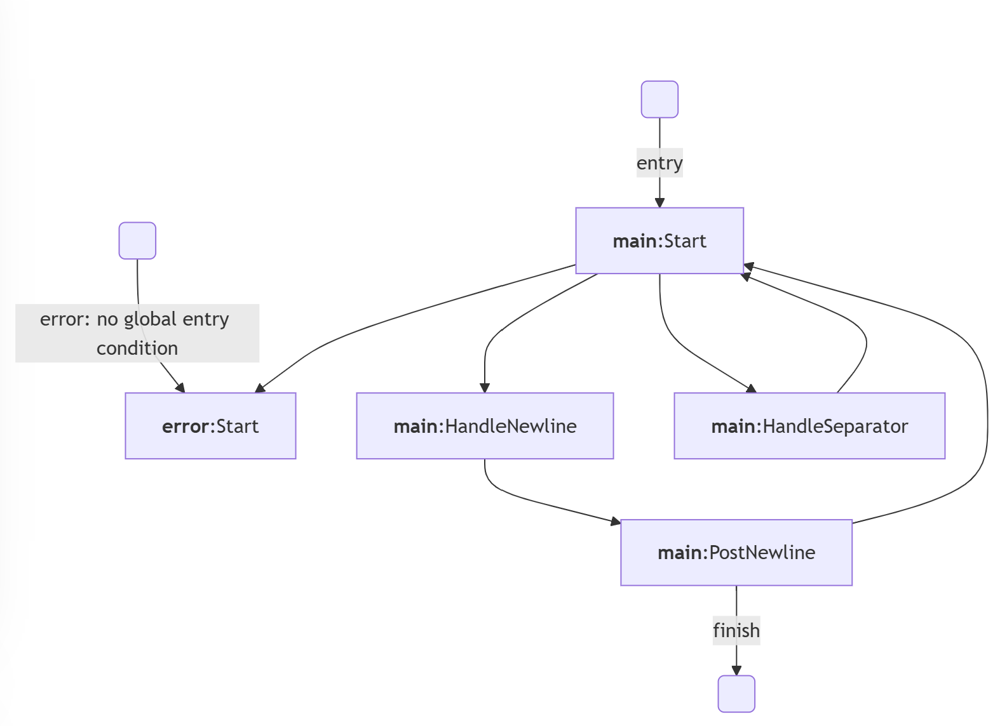

[](https://github.com/nerudaj/dgm-fsm-lib/actions/workflows/main.yml) [](https://github.com/nerudaj/fsm-lib/actions/workflows/integration.yml)

# fsm-lib

This is a C++23 library for creating hierarchical finite state machines, with the emphasis on their usage in videogame AI.

While FSMs are quite simple structures to implement, the code usually quickly devolves into a spaghetti mess. This library enforces one particular paradigm to how FSM should look like so the code can stay consistent and hopefully clean.

## Table of contents

 * [Concepts](#concepts)
 * [Integration](#integration)
 * [Building the FSM](#building-the-fsm)
 * [Blackboards](#blackboards)
 * [Logging](#logging)
 * [Diagram exports](#diagram-exports)
 * [Who's using fsm-cpp?](#whos-using-fsm-cpp)

## Concepts

FSM fall under two categories - Mealy and Moore. Mealy produces output (executes behavior) while transitioning from one state to another. Moore produces outputs based solely on the current state. As I percieve Moore to be more intuitive for programming, this library produces Moore's FSMs.

FSMs consists of states and each state usually consists of two things. A set of conditional transitions that allow it to jump from state to state, and some behavior that is executed when the state is ticked and none of the transitions was taken. In practical code that employs switch-case approach to implement a FSM, these get intermixed quite often, so the following code is nothing unusual:

```c++
case State::DoSomething:
{
	if (shouldTransition())
	{
		someBootstrapLogic();
		return State::NewState;
	}
	
	doSomething();
	
	if (shouldTransitionElsewhere())
	{
		anotherBootstrapLogic();
		return State::OtherState;
	}
	
	doAnotherThing();
} break;
```

This code is bad because `State::DoSomething` covertly does a job of two states, but the author didn't want to bother with introduction of a new enumerated value and abbreviated the code. This obfuscates the general logic behind the FSM, which can really complicate developing game AI. It also makes the life of an AI designer harder as they would like to work with logical primitives and compose them into more complex actions.

This library mandates that each FSM state has an ordered set of conditions associated with transitions, exactly one behavior and a default transition. When a state is "ticked", the following happens:

1) Evaluate all conditions in order. If any condition is evaluated to true, FSM jumps to associated state (executes transition).
2) If no condition was true, execute behavior.
3) After executing behavior, execute default transition. State can jump back to itself, which means it is a **looping** state.

The above algorithm defines clear boundaries for a single `tick` when updating the machine. The tick ends when FSM executes a transition, so you don't have to worry about the tick function getting stuck in an infinite loop.

In addition to these simple rules governing each state, a global error condition can be specified that is evaluated first when ticking the FSM and if evaluated to true, it transitions to an error submachine.

And since I am mentioning submachines, this library allows you to define hierarchical FSMs that can transition to sub-machines and when such sub-machine finishes, it transitions back to a given state in a calling machine. Sub-machine can also transition into other sub-machines, although recursion is prevented by design.

**Blackboards** are used to store all contextual information. Unlike many other similar libraries that give you string-indexed storages that can hold a couple predefined types, here you can just provide any struct, as long as it publicly inherits from `fsm::BlackboardBase`.

## Integration

You can easily get the library using CPM, or you can get it from the Releases tab. More on both approaches [here](docs/Integration.md).

## Building the FSM

All you need to do is to include `<fsm/Builder.hpp>` and construct the machine using a Builder object. For an example CSV parser without quotation support, a builder code could look like this:

```c++
auto&& machine = fsm::Builder<CsvBlackboard>()
    .withErrorMachine() <-- When the current state belongs to this submachine, the fsm::Fsm::isErrored returns true
    .noGlobalEntryCondition()
        .withEntryState("Start")
            .exec(doNothing).andLoop() // <-- You can either loop indefinitely or you can all restart and go back to main entry state
        .done()
    .withMainMachine()
        .withEntryState("Start") // <-- entry point of the whole FSM
            .when(isEof).error() // <-- When error is called, FSM transitions to the entry point of the error machine
            .orWhen(isSeparator).goToState("HandleSeparator")
            .orWhen(isNewline).goToState("HandleNewline")
            .otherwiseExec(advanceChar).andLoop()
        .withState("HandleSeparator")
            .exec(handleSeparator).andGoToState("Start")
        .withState("HandleNewline")
            .exec([] (CsvBlackboard& bb) { // <-- Anything convertible to std::function can be used
                    handleSeparator(bb);
                    handleNewline(bb);
                }).andGoToState("PostNewline")
        .withState("PostNewline")
            .when(isEof).finish() // <-- When the FSM finishes, the fsm::Fsm::isFinished returns true and nothing happens
            .otherwiseExec(doNothing).andGoToState("Start")
        .done()
    .build();
```

Function callbacks that appear in "when/orWhen" statements must have the following signature: `bool(const CsvBlackboard&)` and callbacks that appear in "exec/otherwiseExec" have signature of `void(CsvBlackboard&)`. Thus you can only modify the contents of the blackboard in the latter.

Refer to [example code](examples/02-simple-fsm/Main.cpp) for more info.

## Blackboards

To create a compatible blackboard, just do this:

```c++
#include <fsm/Types.hpp>

struct Blackboard : fsm::BlackboardBase
{
	// Put your required properties here
};
```

Please use `struct` instead of `class` or at least inherit publicly so the properties in the base struct are public. Do not prefix your attributes with double underscores, these should be reserved for the library.

`fsm::BlackboardBase` contains the state of the FSM - what state should be ticked, call stack of sub-machines so it knows where to return, etc.

The blackboard is subject to logging. By default, you'll only get its address for basic identification. If you want to log the contents of the blackboard, you need to specialize `std::formatter` for that purpose.

Refer to [example code](examples/01-loggable-blackboard/Main.cpp) for minimal implementation of such specialization.

## Logging

The library comes pre-packaged with a simple CSV-based logger, but you can implement your own if you wish. The default logger can be used like this:

```c++
#include <fsm/logging/CsvLogger.hpp>

//... create machine
auto&& logger = CsvLogger("path/to/log.csv");
machine.setLogger(logger); // logger must outlive machine
```

## Diagram exports

The library offers the ability to export a diagram representation of the FSM. Currently the only supported format is Mermaid, which you can paste into the [Mermaid online editor](https://mermaid.live/).

You can export just by including `<fsm/exports/MermaidExporter.hpp` and calling the export function right before the build function:

```c++
auto&& machine = fsm::Builder<Blackboard>()
	// ... building machine
    .exportDiagram(fsm::MermaidExporter(std::cout))
    .build();
```

A diagram for the CSV machine then looks like this:



## Who's using fsm-cpp?

 * [Rend](https://nerudaj.itch.io/Rend) - Retro arena FPS
